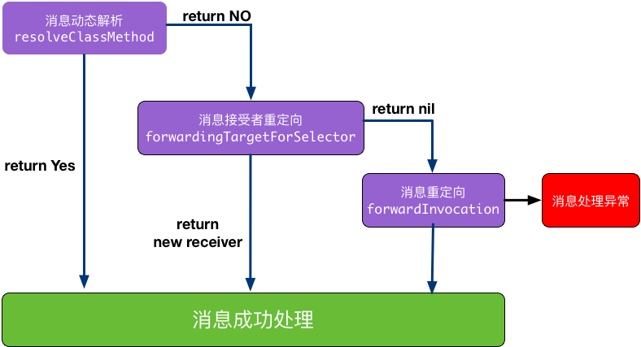

# iOS的运行时特性-基础篇

https://www.jianshu.com/p/d4b55dae9a0d
https://www.jianshu.com/p/fe131f8757ba

目录：
一、怎么理解OC是动态语言，Runtime又是什么？
二、理解消息机制的基本原理
三、与Runtime交互的三种方式
四、分析Runtime中的数据结构
五、深入理解Rutime消息发送原理
六、多继承的实现思路：Runtime
七、最后总结
**OC动态语言的理解-Runtime**

静态语言：如C语言，**编译阶段就要决定调用哪个函数**，如果函数未实现就会编译报错。
动态语言：如OC语言，编译阶段并不能决定真正调用哪个函数，只要函数声明过即使没有实现也不会报错。
我们常说OC是一门动态语言，就是因为它总是把一些决定性的工作从编译阶段推迟到运行时阶段。OC代码的运行不仅需要编译器，还需要运行时系统(Runtime Sytem)来执行编译后的代码。
Runtime是一套底层纯C语言API，OC代码最终都会被编译器转化为运行时代码，通过消息机制决定函数调用方式，这也是OC作为动态语言使用的基础。

**理解消息机制的基本原理**

第一步：编译阶段
[receiver selector]方法被编译器转化，分为两种情况：
1.不带参数的方法被编译为：objc_msgSend(receiver，selector)
2.带参数的方法被编译为：objc_msgSend(recevier，selector，org1，org2，…)

第二步：运行时阶段
消息接收者recever寻找对应的selector，也分为两种情况：
1.接收者能找到对应的selector，直接执行接收receiver对象的selector方法。
2.接收者找不到对应的selector，消息被转发或者临时向接收者添加这个selector对应的实现内容，否则崩溃。

**说明：OC调用方法[receiver selector]，编译阶段确定了要向哪个接收者发送message消息，但是接收者如何响应决定于运行时的判断。**


三、与Runtime的交互

Runtime的官方文档中将OC与Runtime的交互划分三种层次：OC源代码，NSObject方法，Runtime 函数。这其实也是按照与Runtime交互程度从低到高排序的三种方式。

1.OC源代码(Objec-C Source Code)

我们已经说过，OC代码会在编译阶段被编译器转化。OC中的类、方法和协议等在Runtime中都由一些数据结构来定义。所以，我们平时直接使用OC编写代码，其实这已经是在和Runtime进行交互了，只不过这个过程对于我们来说是无感的。

2.NSObject方法(NSObject Methods)

Runtime的最大特征就是实现了OC语言的动态特性。作为大部分Objective-C类继承体系的根类的NSObject，其本身就具有了一些非常具有运行时动态特性的方法，比如respondsToSelector:方法可以检查在代码运行阶段当前对象是否能响应指定的消息，所以使用这些方法也算是一种与Runtme的交互方式，类似的方法还有如下：


```-description：//返回当前类的描述信息

-class //方法返回对象的类；

-isKindOfClass: 和 -isMemberOfClass:  //检查对象是否存在于指定的类的继承体系中

-respondsToSelector:    //检查对象能否响应指定的消息；

-conformsToProtocol:    //检查对象是否实现了指定协议类的方法；

-methodForSelector:     //返回指定方法实现的地址。
```
3.使用Runtime函数(Runtime Functions)

Runtime系统是一个由一系列函数和数据结构组成，具有公共接口的动态共享库。头文件存放于/usr/include/objc目录下。在我们工程代码里引用Runtime的头文件，同样能够实现类似OC代码的效果，一些代码示例如下：

```//相当于：Class class = [UIView class];
Class viewClass = objc_getClass("UIView");
    
//相当于：UIView *view = [UIView alloc];
UIView *view = ((id (*)(id, SEL))(void *)objc_msgSend)((id)viewClass, sel_registerName("alloc"));

//相当于：UIView *view = [view init];
((id (*)(id, SEL))(void *)objc_msgSend)((id)view, sel_registerName("init"));
```

三、分析Runtime中数据结构

OC代码被编译器转化为C语言，然后再通过运行时执行，最终实现了动态调用。这其中的OC类、对象和方法等都对应了C中的结构体，而且我们都可以在Rutime源码中找到它们的定义。

那么，我们如何来查看Runtime的代码呢？其实很简单，只需要我们在当前代码文件中引用头文件：


```
 #import <objc/runtime.h>
 #import <objc/message.h>
```
然后，我们需要使用组合键"Command +鼠标点击"，即可进入Runtime的源码文件，下面我们继续来一一分析> OC代码在C中对应的结构。

**1.id—>objc_object**

id是一个指向objc_object结构体的指针，即在Runtime中：


```///A pointer to an instance of a class.
typedef struct objc_object *id;
```
下面是Runtime中对objc_object结构体的具体定义：


```
///Represents an instance of a class.
struct objc_object {
    Class _Nonnull isa  OBJC_ISA_AVAILABILITY;
};
```

我们都知道id在OC中是表示一个任意类型的类实例，从这里也可以看出，OC中的对象虽然没有明显的使用指针，但是在OC代码被编译转化为C之后，每个OC对象其实都是拥有一个isa的指针的。

**2.Class - >objc_classs**

class是一个指向objc_class结构体的指针，即在Runtime中：


```
typedef struct objc_class *Class; 

```

```
//usr/include/objc/runtime.h
struct objc_class {
    Class _Nonnull isa  OBJC_ISA_AVAILABILITY;
#if !OBJC2

    Class Nullable super_class                              OBJC2UNAVAILABLE;
    const char * Nonnull name                               OBJC2UNAVAILABLE;
    long version                                             OBJC2_UNAVAILABLE;
    long info                                                OBJC2_UNAVAILABLE;
    long instance_size                                       OBJC2_UNAVAILABLE;
    struct objc_ivar_list * Nullable ivars                  OBJC2UNAVAILABLE;
    struct objc_method_list * Nullable * _Nullable methodLists                    OBJC2UNAVAILABLE;
    struct objc_cache * Nonnull cache                       OBJC2UNAVAILABLE;
    struct objc_protocol_list * Nullable protocols          OBJC2UNAVAILABLE;
#endif
} OBJC2_UNAVAILABLE;


```

**理解objc_class定义中的参数**：

**isa指针：**

我们会发现objc_class和objc_object同样是结构体，而且都拥有一个isa指针。我们很容易理解objc_object的isa指针指向对象的定义，那么objc_class的指针是怎么回事呢？
其实，在Runtime中Objc类本身同时也是一个对象。Runtime把类对象所属类型就叫做元类，用于描述类对象本身所具有的特征，最常见的类方法就被定义于此，所以objc_class中的isa指针指向的是元类，每个类仅有一个类对象，而每个类对象仅有一个与之相关的元类。

**super_class指针：**

super_class指针指向objc_class类所继承的父类，但是如果当前类已经是最顶层的类(如NSProxy),则super_class指针为NULL


**cache:**

为了优化性能，objc_class中的cache结构体用于记录每次使用类或者实例对象调用的方法。这样每次响应消息的时候，Runtime系统会优先在cache中寻找响应方法，相比直接在类的方法列表中遍历查找，效率更高。

**ivars:**
ivars用于存放所有的成员变量和属性信息，属性的存取方法都存放在methodLists中。

**methodLists：**

methodLists用于存放对象的所有成员方法。


**3.SEL**

SEL是一个指向objc_selector结构体的指针，即在Runtime中：


```/// An opaque type that represents a method selector.
typedef struct objc_selector *SEL;
```

SEL在OC中称作方法选择器，用于表示运行时方法的名字，然而我们并不能在Runtime中找到它的结构体的详细定义。Objective-C在编译时，会依据每一个方法的名字、参数序列，生成一个唯一的整型标识(Int类型的地址)，这个标识就是SEL。

注意：
1.不同类中相同名字的方法对应的方法选择器是相同的。
2.即使是同一个类中，方法名相同而变量类型不同也会导致它们具有相同的方法选择器。

通常我们获取SEL有三种方法：
1.OC中，使用@selector(“方法名字符串”)
2.OC中，使用NSSelectorFromString(“方法名字符串”)
3.Runtime方法，使用sel_registerName(“方法名字符串”)

**4.Ivar**

Ivar代表类中实例变量的类型，是一个指向ojbcet_ivar的结构体的指针，即在Runtime中：


```/// An opaque type that represents an instance variable.
typedef struct objc_ivar *Ivar;

```

下面是Runtime中对objc_ivar结构体的具体定义：


```
struct objc_ivar {
    char * Nullable ivar_name                               OBJC2UNAVAILABLE;
    char * Nullable ivar_type                               OBJC2UNAVAILABLE;
    int ivar_offset                                          OBJC2_UNAVAILABLE;
#ifdef LP64
    int space                                                OBJC2_UNAVAILABLE;
#endif
}  
```

我们在objc_class中看到的ivars成员列表,其中的元素就是Ivar，我可以通过实例查找其在类中的名字，这个过程被称为反射，下面的class_copyIvarList获取的不仅有实例变量还有属性：


``` 
Ivar *ivarList = class_copyIvarList([self class], &count);
    for (int i= 0; i<count; i++) {
        Ivar ivar = ivarList[i];
        const char *ivarName = ivar_getName(ivar);
        NSLog(@"Ivar(%d): %@", i, [NSString stringWithUTF8String:ivarName]);
    }
 free(ivarList)；
```

**5.Method**
Method表示某个方法的类型，即在Runtime中：

```/// An opaque type that represents a method in a class definition.
typedef struct objc_method *Method;
```

我们可以在objct_class定义中看到methodLists，其中的元素就是Method，下面是Runtime中objc_method结构体的具体定义


```
struct objc_method {
    SEL Nonnull method_name                                 OBJC2UNAVAILABLE;
    char * Nullable method_types                            OBJC2UNAVAILABLE;
    IMP Nonnull method_imp                                  OBJC2UNAVAILABLE;
}   
``` 

理解objc_method定义中的参数：
method_name:方法名类型SEL
method_types: 一个char指针，指向存储方法的参数类型和返回值类型
method_imp：本质上是一个指针，指向方法的实现
这里其实就是SEL(method_name)与IMP(method_name)形成了一个映射，通过SEL，我们可以很方便的找到方法实现IMP。

**5.IMP**

```
/// A pointer to the function of a method implementation.
typedef void (IMP)(void / id, SEL, ... */ ); 

```


IMP这个函数指针指向了方法实现的首地址，当OC发起消息后，最终执行的代码是由IMP指针决定的。利用这个特性，我们可以对代码进行优化：当需要大量重复调用方法的时候，我们可以绕开消息绑定而直接利用IMP指针调起方法，这样的执行将会更加高效，相关的代码示例如下


```
void (*setter)(id, SEL, BOOL);
int i;
setter = (void (*)(id, SEL, BOOL))[target methodForSelector:@selector(setFilled:)];
for ( i = 0 ; i < 1000 ; i++ )
    setter(targetList[i], @selector(setFilled:), YES);

```
注意：这里需要注意的就是函数指针的前两个参数必须是id和SEL。


**四、深入理解Rutime消息发送**

我们在分析了OC语言对应的底层C结构之后，现在可以进一步理解运行时的消息发送机制。先前讲到，OC调用方法被编译转化为如下的形式：

```
id _Nullable objc_msgSend(id _Nullable self, SEL _Nonnull op, ...)
```
其实，除了常见的objc_msgSend，消息发送的方法还有
objc_msgSend_stret,objc_msgSendSuper,objc_msgSendSuper_stret等，如果消息传递给超类就使用带有super的方法，如果返回值是结构体而不是简单值就使用带有stret的值。

运行时阶段的消息发送的详细步骤如下：

1.检测selector 是不是需要忽略的。比如 Mac OS X 开发，有了垃圾回收就不理会retain,release 这些函数了。

2.检测target 是不是nil 对象。ObjC 的特性是允许对一个 nil对象执行任何一个方法不会 Crash，因为会被忽略掉。

3如果上面两个都过了，那就开始查找这个类的 IMP，先从 cache 里面找，若可以找得到就跳到对应的函数去执行。

4.如果在cache里找不到就找一下方法列表methodLists。
如果methodLists找不到，就到超类的方法列表里寻找，一直找，直到找到NSObject类为止。

5.如果还找不到，Runtime就提供了如下三种方法来处理：动态方法解析、消息接受者重定向、消息重定向，这三种方法的调用关系如下图：




消息转发流程图.png
1.动态方法解析(Dynamic Method Resolution)

所谓动态解析，我们可以理解为通过cache和方法列表没有找到方法时，Runtime为我们提供一次动态添加方法实现的机会，主要用到的方法如下：

```
//OC方法：
//类方法未找到时调起，可于此添加类方法实现
+ (BOOL)resolveClassMethod:(SEL)sel
//实例方法未找到时调起，可于此添加实例方法实现
+ (BOOL)resolveInstanceMethod:(SEL)sel

//Runtime方法：
/**
 运行时方法：向指定类中添加特定方法实现的操作
 @param cls 被添加方法的类
 @param name selector方法名
 @param imp 指向实现方法的函数指针
 @param types imp函数实现的返回值与参数类型
 @return 添加方法是否成功
 */
BOOL class_addMethod(Class _Nullable cls,
                     SEL _Nonnull name,
                     IMP _Nonnull imp,
                     const char * _Nullable types)
```
下面使用一个示例来说明动态解析：Perosn类中声明方法却未添加实现，我们通过Runtime动态方法解析的操作为其他添加方法实现，具体代码如下：


```//Person.h文件

@interface Person : NSObject
//声明类方法，但未实现
+ (void)haveMeal:(NSString *)food;
//声明实例方法，但未实现
- (void)singSong:(NSString *)name;
@end
//Person.m文件

#import "Person.h"
#import <objc/runtime.h>
@implementation Person
//重写父类方法：处理类方法
+ (BOOL)resolveClassMethod:(SEL)sel{
    if(sel == @selector(haveMeal:)){
        class_addMethod(object_getClass(self), sel, class_getMethodImplementation(object_getClass(self), @selector(zs_haveMeal:)), "v@");
        return YES;   //添加函数实现，返回YES
    }
    return [class_getSuperclass(self) resolveClassMethod:sel];
}
//重写父类方法：处理实例方法
+ (BOOL)resolveInstanceMethod:(SEL)sel{
    if(sel == @selector(singSong:)){
        class_addMethod([self class], sel, class_getMethodImplementation([self class], @selector(zs_singSong:)), "v@");
        return YES;
    }
    return [super resolveInstanceMethod:sel];
}


+ (void)zs_haveMeal:(NSString *)food{
    NSLog(@"%s",__func__);
}

- (void)zs_singSong:(NSString *)name{
    NSLog(@"%s",__func__);
}
//TestViewController.m文件
//测试：Peson调用并未实现的类方法、实例方法，并没有崩溃
Person *ps = [[Person alloc] init];
[Person haveMeal:@"Apple"]; //打印：+[Person zs_haveMeal:]
[ps singSong:@"纸短情长"];   //打印：-[Person zs_singSong:]
```
注意1：我们注意到class_addMethod方法中的特殊参数“v@”，具体可参考这里
注意2：成功使用动态方法解析还有个前提，那就是我们必须存在可以处理消息的方法，比如上述代码中的zs_haveMeal：与zs_singSong：

2.消息接收者重定向

我们注意到动态方法解析过程中的两个resolve方法都返回了布尔值，当它们返回YES时方法即可正常执行，但是若它们返回NO，消息发送机制就进入了消息转发(Forwarding)的阶段了，我们可以使用Runtime通过下面的方法替换消息接收者的为其他对象，从而保证程序的继续执行。

//重定向类方法的消息接收者，返回一个类
- (id)forwardingTargetForSelector:(SEL)aSelector

//重定向实例方法的消息接受者，返回一个实例对象
- (id)forwardingTargetForSelector:(SEL)aSelector
下面使用一个示例来说明消息接收者的重定向：
我们创建一个Student类，声明并实现takeExam：、learnKnowledge：两个方法，然后在视图控制器TestViewController(一个继承了UIViewController的自定义类)里测试，关键代码如下：


```//Student.h文件

@interface Student : NSObject
//类方法：参加考试
+ (void)takeExam:(NSString *)exam;
//实例方法：学习知识
- (void)learnKnowledge:(NSString *)course;
@end
//  Student.m文件

@implementation Student
+ (void)takeExam:(NSString *)exam{
    NSLog(@"%s",__func__);
}
- (void)learnKnowledge:(NSString *)course{
    NSLog(@"%s",__func__);
}
@end
//TestViewConroller.m文件
//重定向类方法：返回一个类对象
+ (id)forwardingTargetForSelector:(SEL)aSelector{
    if (aSelector == @selector(takeExam:)) {
         
        return [Student class];
    }
    return [super forwardingTargetForSelector:aSelector];
}
//重定向实例方法：返回类的实例
- (id)forwardingTargetForSelector:(SEL)aSelector{
    if (aSelector == @selector(learnKnowledge:)) {
        return self.student;
    }
    return [super forwardingTargetForSelector:aSelector];
}


//在TestViewConroller的viewDidLoad中测试：
//调用并未声明和实现的类方法
[TestViewController performSelector:@selector(takeExam:) withObject:@"语文"];

//调用并未声明和实现的类方法
self.student = [[Student alloc] init];
[self performSelector:@selector(learnKnowledge:) withObject:@"天文学知识"];

//正常打印:
// +[Student takeExam:]
// -[Student learnKnowledge:]
```
注意：动态方法解析阶段返回NO时，我们可以通过forwardingTargetForSelector可以修改消息的接收者，该方法返回参数是一个对象，如果这个对象是非nil，非self，系统会将运行的消息转发给这个对象执行。否则，继续查找其他流程。

3.消息重定向

当以上两种方法无法生效，那么这个对象会因为找不到相应的方法实现而无法响应消息，此时Runtime系统会通过forwardInvocation：消息通知该对象，给予此次消息发送最后一次寻找IMP的机会：

**
```- (void)forwardInvocation:(NSInvocation *)anInvocation；
其实每个对象都从NSObject类中继承了forwardInvocation：方法，但是NSObject中的这个方法只是简单的调用了doesNotRecongnizeSelector:方法，提示我们错误。所以我们可以重写这个方法：对不能处理的消息做一些默认处理，也可以将消息转发给其他对象来处理，而不抛出错误。

我们注意到anInvocation是forwardInvocation唯一参数，它封装了原始的消息和消息参数。正是因为它，我们还不得不重写另一个函数：methodSignatureForSelector。这是因为在forwardInvocation: 消息发送前，Runtime系统会向对象发送methodSignatureForSelector消息，并取到返回的方法签名用于生成NSInvocation对象。

下面使用一个示例来重新定义转发逻辑：在上面的TestViewController添加如下代码：

-(void)forwardInvocation:(NSInvocation *)anInvocation{
    //1.从anInvocation中获取消息
    SEL sel = anInvocation.selector;
    //2.判断Student方法是否可以响应应sel
    if ([self.student respondsToSelector:sel]) {
        //2.1若可以响应，则将消息转发给其他对象处理
        [anInvocation invokeWithTarget:self.student];
    }else{
        //2.2若仍然无法响应，则报错：找不到响应方法
        [self doesNotRecognizeSelector:sel];
    }
}

//需要从这个方法中获取的信息来创建NSInvocation对象，因此我们必须重写这个方法，为给定的selector提供一个合适的方法签名。
- (NSMethodSignature*)methodSignatureForSelector:(SEL)aSelector{
    NSMethodSignature *methodSignature = [super methodSignatureForSelector:aSelector];
    if (!methodSignature) {
        methodSignature = [NSMethodSignature signatureWithObjCTypes:"v@:*"];
    }
    return methodSignature;
}
然后再在视图控制器里直接调用Student的方法如下：

//self是当前的TestViewController,调用了自己并不存在的learnKonwledge:方法
[self performSelector:@selector(learnKnowledge:) withObject:@"天文学”];

//正常打印:
//-[Student learnKnowledge:]
```**
总结：

1.从以上的代码中就可以看出，forwardingTargetForSelector仅支持一个对象的返回，也就是说消息只能被转发给一个对象，而forwardInvocation可以将消息同时转发给任意多个对象，这就是两者的最大区别。

2.虽然理论上可以重载doesNotRecognizeSelector函数实现保证不抛出异常（不调用super实现），但是苹果文档着重提出“一定不能让这个函数就这么结束掉，必须抛出异常”。(If you override this method, you must call super or raise an invalidArgumentException exception at the end of your implementation. In other words, this method must not return normally; it must always result in an exception being thrown.)

3.forwardInvocation甚至能够修改消息的内容，用于实现更加强大的功能。

六、多继承的实现思路：Runtime

我们会发现Runtime消息转发的一个特点：一个对象可以调起它本身不具备的方法。这个过程与OC中的继承特性很相似，其实官方文档中图示也很好的说明了这个问题：


forwarding.png
图中的Warrior通过forwardInvocation：将negotiate消息转发给了Diplomat，这就好像是Warrior使用了超类Diplomat的方法一样。所以从这个思路，我们可以在实际开发需求中模拟多继承的操作。

七、最后总结：

以上就是iOS运行时的基础知识部分了，理解Runtime的工作原理，下一篇iOS运行时Runtime应用，将总结其在实际开发中的使用。
处。
