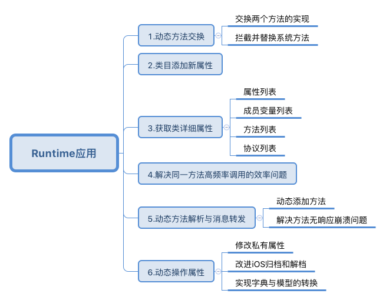

# # iOS的运行时特性-应用篇
转自：https://www.jianshu.com/p/fe131f8757ba

在上篇文章iOS运行时Runtime基础后，本篇将会总结Rutime的具体应用实例，结合其动态特性，Runtime在开发中的应用大致分为
以下几个方面：


相关文章:iOS运行时Runtime基础

一、动态方法交换：Method Swizzling

实现动态方法交换(Method Swizzling )是Runtime中最具盛名的应用场景，其原理是：通过Runtime获取到方法实现的地址，进而动态交换两个方法的功能。使用到关键方法如下：


```//获取类方法的Mthod
Method _Nullable class_getClassMethod(Class _Nullable cls, SEL _Nonnull name)
//获取实例对象方法的Mthod
Method _Nullable class_getInstanceMethod(Class _Nullable cls, SEL _Nonnull name)
//交换两个方法的实现
void method_exchangeImplementations(Method _Nonnull m1, Method _Nonnull m2)
1.动态方法交换示例

现在演示一个代码示例：在视图控制中，定义两个实例方法printA与printB，然后执行交换

- (void)printA{
    NSLog(@"打印A......");
}

- (void)printB{
    NSLog(@"打印B......");
}

//交换方法的实现，并测试打印
Method methodA = class_getInstanceMethod([self class], @selector(printA));
Method methodB = class_getInstanceMethod([self class], @selector(printB));
method_exchangeImplementations(methodA, methodB);

[self printA];  //打印B......
[self printB];  //打印A......
```


2.拦截并替换系统方法

Runtime动态方法交换更多的是应用于系统类库和第三方框架的方法替换。在不可见源码的情况下，我们可以借助Rutime交换方法实现，为原有方法添加额外功能，这在实际开发中具有十分重要的意义。

下面将展示一个拦截并替换系统方法的示例：为了实现不同机型上的字体都按照比例适配，我们可以拦截系统UIFont的systemFontOfSize方法，具体操作如下：

步骤1：在当前工程中添加UIFont的分类：UIFont +Adapt,并在其中添用以替换的方法。


```+ (UIFont *)zs_systemFontOfSize:(CGFloat)fontSize{
    //获取设备屏幕宽度，并计算出比例scale
    CGFloat width = [[UIScreen mainScreen] bounds].size.width;
    CGFloat scale  = width/375.0;
    //注意：由于方法交换，系统的方法名已变成了自定义的方法名，所以这里使用了
    //自定义的方法名来获取UIFont
    return [UIFont zs_systemFontOfSize:fontSize * scale];
}
```
步骤2：在UIFont的分类中拦截系统方法，将其替换为我们自定义的方法，代码如下：

//load方法不需要手动调用，iOS会在应用程序启动的时候自动调起load方法，而且执行时间较早，所以在此方法中执行交换操作比较合适。

```+ (void)load{
    //获取系统方法地址
    Method sytemMethod = class_getClassMethod([UIFont class], @selector(systemFontOfSize:));
    //获取自定义方法地址
    Method customMethod = class_getClassMethod([UIFont class], @selector(zs_systemFontOfSize:));
    //交换两个方法的实现
    method_exchangeImplementations(sytemMethod, customMethod);
}
添加一段测试代码，切换不同的模拟器，观察在不同机型上文字的大小：

UILabel *label = [[UILabel alloc] initWithFrame:CGRectMake(0, 100, 300, 50)];
label.text = @"测试Runtime拦截方法";
label.font = [UIFont systemFontOfSize:20];
[self.view addSubview:label];
```


二、实现分类添加新属性
我们在开发中常常使用类目Category为一些已有的类扩展功能。虽然继承也能够为已有类增加新的方法，而且相比类目更是具有增加属性的优势，但是继承毕竟是一个重量级的操作，添加不必要的继承关系无疑增加了代码的复杂度。

遗憾的是，OC的类目并不支持直接添加属性，如果我们直接在分类的声明中写入Property属性，那么只能为其生成set与get方法声明，却不能生成成员变量，直接调用这些属性还会造成崩溃。

所以为了实现给分类添加属性，我们还需借助Runtime的关联对象(Associated Objects)特性，它能够帮助我们在运行阶段将任意的属性关联到一个对象上，下面是相关的三个方法：

```
/**
 1.给对象设置关联属性
 @param object 需要设置关联属性的对象，即给哪个对象关联属性
 @param key 关联属性对应的key，可通过key获取这个属性，
 @param value 给关联属性设置的值
 @param policy 关联属性的存储策略(对应Property属性中的assign,copy，retain等)
 OBJC_ASSOCIATION_ASSIGN             @property(assign)。
 OBJC_ASSOCIATION_RETAIN_NONATOMIC   @property(strong, nonatomic)。
 OBJC_ASSOCIATION_COPY_NONATOMIC     @property(copy, nonatomic)。
 OBJC_ASSOCIATION_RETAIN             @property(strong,atomic)。
 OBJC_ASSOCIATION_COPY               @property(copy, atomic)。
 */
void objc_setAssociatedObject(id _Nonnull object,
                              const void * _Nonnull key,
                              id _Nullable value,
                              objc_AssociationPolicy policy)
/**
 2.通过key获取关联的属性
 @param object 从哪个对象中获取关联属性
 @param key 关联属性对应的key
 @return 返回关联属性的值
 */
id _Nullable objc_getAssociatedObject(id _Nonnull object,
                                      const void * _Nonnull key)
/**
 3.移除对象所关联的属性
 @param object 移除某个对象的所有关联属性
 */
void objc_removeAssociatedObjects(id _Nonnull object)
```


注意：key与关联属性一一对应，我们必须确保其全局唯一性，常用我们使用@selector(methodName)作为key。
现在演示一个代码示例：为UIImage增加一个分类：UIImage+Tools，并为其设置关联属性urlString(图片网络链接属性），相关代码如下：

```
//UIImage+Tools.h文件中
UIImage+Tools.m
@interface UIImage (Tools)
//添加一个新属性：图片网络链接
@property(nonatomic,copy)NSString *urlString;
@end
//UIImage+Tools.m文件中
#import "UIImage+Tools.h"
#import <objc/runtime.h>
@implementation UIImage (Tools)
//set方法
- (void)setUrlString:(NSString *)urlString{
    objc_setAssociatedObject(self,
                             @selector(urlString),
                             urlString,
                             OBJC_ASSOCIATION_RETAIN_NONATOMIC);
}
//get方法
- (NSString *)urlString{
    return objc_getAssociatedObject(self,
                                    @selector(urlString));
}
//添加一个自定义方法，用于清除所有关联属性
- (void)clearAssociatedObjcet{
    objc_removeAssociatedObjects(self);
}
@end
测试文件中:

UIImage *image = [[UIImage alloc] init];
image.urlString = @"http://www.image.png";
NSLog(@"获取关联属性：%@",image.urlString);
    
[image clearAssociatedObjcet];
NSLog(@"获取关联属性：%@",image.urlString);
//打印：
//获取关联属性：http://www.image.png
// 获取关联属性：(null)
三、获取类的详细信息

1.获取属性列表

unsigned int count;
objc_property_t *propertyList = class_copyPropertyList([self class], &count);
for (unsigned int i = 0; i<count; i++) {
    const char *propertyName = property_getName(propertyList[i]);
    NSLog(@"PropertyName(%d): %@",i,[NSString stringWithUTF8String:propertyName]);
}
free(propertyList);
2.获取所有成员变量

Ivar *ivarList = class_copyIvarList([self class], &count);
for (int i= 0; i<count; i++) {
    Ivar ivar = ivarList[i];
    const char *ivarName = ivar_getName(ivar);
    NSLog(@"Ivar(%d): %@", i, [NSString stringWithUTF8String:ivarName]);
}
free(ivarList);
3.获取所有方法

Method *methodList = class_copyMethodList([self class], &count);
for (unsigned int i = 0; i<count; i++) {
    Method method = methodList[i];
    SEL mthodName = method_getName(method);
    NSLog(@"MethodName(%d): %@",i,NSStringFromSelector(mthodName));
}
free(methodList);
4.获取当前遵循的所有协议

__unsafe_unretained Protocol **protocolList = class_copyProtocolList([self class], &count);
for (int i=0; i<count; i++) {
    Protocol *protocal = protocolList[i];
    const char *protocolName = protocol_getName(protocal);
    NSLog(@"protocol(%d): %@",i, [NSString stringWithUTF8String:protocolName]);
}
free(propertyList);
注意：C语言中使用Copy操作的方法，要注意释放指针，防止内存泄漏

```
**四、解决同一方法高频率调用的效率问题**

Runtime源码中的IMP作为函数指针，指向方法的实现。通过它，我们可以绕开发送消息的过程来提高函数调用的效率。当我们需要持续大量重复调用某个方法的时候，会十分有用，具体代码示例如下：


```
void (*setter)(id, SEL, BOOL);
int i;

setter = (void (*)(id, SEL, BOOL))[target methodForSelector:@selector(setFilled:)];
for ( i = 0 ; i < 1000 ; i++ )
    setter(targetList[i], @selector(setFilled:), YES);
```
**五、方法动态解析与消息转发**

其实该部分可以参考基础篇中内容，这里不再重复赘述，只是大概做出一些总结。

1.动态方法解析：动态添加方法

Runtime足够强大，能够让我们在运行时动态添加一个未实现的方法，这个功能主要有两个应用场景：
场景1：动态添加未实现方法，解决代码中因为方法未找到而报错的问题；
场景2：利用懒加载思路，若一个类有很多个方法，同时加载到内存中会耗费资源，可以使用动态解析添加方法。方法动态解析主要用到的方法如下：


```//OC方法：
//类方法未找到时调起，可于此添加类方法实现
+ (BOOL)resolveClassMethod:(SEL)sel

//实例方法未找到时调起，可于此添加实例方法实现
+ (BOOL)resolveInstanceMethod:(SEL)sel

//Runtime方法：
/**
 运行时方法：向指定类中添加特定方法实现的操作
 @param cls 被添加方法的类
 @param name selector方法名
 @param imp 指向实现方法的函数指针
 @param types imp函数实现的返回值与参数类型
 @return 添加方法是否成功
 */
BOOL class_addMethod(Class _Nullable cls,
                     SEL _Nonnull name,
                     IMP _Nonnull imp,
                     const char * _Nullable types)
```
2.解决方法无响应崩溃问题

执行OC方法其实就是一个发送消息的过程，若方法未实现，我们可以利用方法动态解析与消息转发来避免程序崩溃，这主要涉及下面一个处理未实现消息的过程：


消息转发流程图.png
除了上述的方法动态解析，还使用到的相关方法如下：
消息接收者重定向


```//重定向类方法的消息接收者，返回一个类
- (id)forwardingTargetForSelector:(SEL)aSelector

//重定向实例方法的消息接受者，返回一个实例对象
- (id)forwardingTargetForSelector:(SEL)aSelector
消息重定向

- (void)forwardInvocation:(NSInvocation *)anInvocation；

- (NSMethodSignature*)methodSignatureForSelector:(SEL)aSelector;
```
六、动态操作属性
1.动态修改属性变量
现在假设这样一个情况：我们使用第三方框架里的Person类，在特殊需求下想要更改其私有属性nickName，这样的操作我们就可以使用Runtime可以动态修改对象属性。
**基本思路：首先使用Runtime获取Peson对象的所有属性，找到nickName，然后使用ivar的方法修改其值。具体的代码示例如下：
**
```Person *ps = [[Person alloc] init];
NSLog(@"ps-nickName: %@",[ps valueForKey:@"nickName"]); //null
//第一步：遍历对象的所有属性
unsigned int count;
Ivar *ivarList = class_copyIvarList([ps class], &count);
for (int i= 0; i<count; i++) {
    //第二步：获取每个属性名
    Ivar ivar = ivarList[i];
    const char *ivarName = ivar_getName(ivar);
    NSString *propertyName = [NSString stringWithUTF8String:ivarName];
    if ([propertyName isEqualToString:@"_nickName"]) {
        //第三步：匹配到对应的属性，然后修改；注意属性带有下划线
        object_setIvar(ps, ivar, @"梧雨北辰");
    }
}
NSLog(@"ps-nickName: %@",[ps valueForKey:@"nickName"]); //梧雨北辰
总结：此过程类似KVC的取值和赋值
```

**2.实现 NSCoding 的自动归档和解档**

**归档是一种常用的轻量型文件存储方式，但是它有个弊端：在归档过程中，若一个Model有多个属性，我们不得不对每个属性进行处理，非常繁琐。
归档操作主要涉及两个方法：encodeObject 和 decodeObjectForKey，现在，我们可以利用Runtime来改进它们，关键的代码示例如下：**
//原理：使用Runtime动态获取所有属性
//解档操作

```
- (instancetype)initWithCoder:(NSCoder *)aDecoder{
    self = [super init];
    if (self) {
        unsigned int count = 0;
        
        Ivar *ivarList = class_copyIvarList([self class], &count);
        for (int i = 0; i < count; i++) {
            Ivar ivar = ivarList[i];
            const char *ivarName = ivar_getName(ivar);
            NSString *key = [NSString stringWithUTF8String:ivarName];
            id value = [aDecoder decodeObjectForKey:key];
            [self setValue:value forKey:key];
        }
        free(ivarList); //释放指针
    }
    return self;
}

```
//归档操作

```
- (void)encodeWithCoder:(NSCoder *)aCoder{
    unsigned int count = 0;
    
    Ivar *ivarList = class_copyIvarList([self class], &count);
    for (NSInteger i = 0; i < count; i++) {
        Ivar ivar = ivarList[i];
        NSString *key = [NSString stringWithUTF8String:ivar_getName(ivar)];
        
        id value = [self valueForKey:key];
        [aCoder encodeObject:value forKey:key];
    }
    free(ivarList); //释放指针
}
```
下面是有关归档的测试代码：


```//--测试归档
Person *ps = [[Person alloc] init];
ps.name = @"梧雨北辰";
ps.age  = 18;
NSString *temp = NSTemporaryDirectory();
NSString *fileTemp = [temp stringByAppendingString:@"person.archive"];
[NSKeyedArchiver archiveRootObject:ps toFile:fileTemp];

//--测试解档
NSString *temp = NSTemporaryDirectory();
NSString *fileTemp = [temp stringByAppendingString:@"person.henry"];
Person *person = [NSKeyedUnarchiver unarchiveObjectWithFile:fileTemp];
NSLog(@"person-name:%@，person-age:%ld",person.name,person.age); 
//person-name:梧雨北辰，person-age:18

```

3.实现字典与模型的转换


```字典数据转模型的操作在项目开发中很常见，通常我们会选择第三方如YYModel；其实我们也可以自己来实现这一功能，主要的思路有两种：KVC、Runtime，总结字典转化模型过程中需要解决的问题如下：

```


**现在，我们使用Runtime来实现字典转模型的操作，大致的思路是这样：
借助Runtime可以动态获取成员列表的特性，遍历模型中所有属性，然后以获取到的属性名为key，在JSON字典中寻找对应的值value；再将每一个对应Value赋值给模型，就完成了字典转模型的目的。**

首先准备下面的JSON数据用于测试：

{
    "id":"2462079046",
    "name": "梧雨北辰",
    "age":"18",
    "weight":140,
    "address":{
            "country":"中国",
            "province": "河南"
            },
    "courses":[{
               "name":"Chinese",
               "desc":"语文课"
    },{
               "name":"Math",
               "desc":"数学课"
    },{
               "name":"English",
               "desc":"英语课"
    }
    ]
}
具体的代码实现流程如下：


```步骤1：创建NSObject的类目NSObject+ZSModel，用于实现字典转模型

**@interface NSObject (ZSModel)
+ (instancetype)zs_modelWithDictionary:(NSDictionary *)dictionary;
@end

//ZSModel协议，协议方法可以返回一个字典，表明特殊字段的处理规则
@protocol ZSModel<NSObject>
@optional
+ (nullable NSDictionary<NSString *, id> *)modelContainerPropertyGenericClass;
@end;
#import "NSObject+ZSModel.h"
#import <objc/runtime.h>
@implementation NSObject (ZSModel)
+ (instancetype)zs_modelWithDictionary:(NSDictionary *)dictionary{
    
    //创建当前模型对象
    id object = [[self alloc] init];
    //1.获取当前对象的成员变量列表
    unsigned int count = 0;
    Ivar *ivarList = class_copyIvarList([self class], &count);
    
    //2.遍历ivarList中所有成员变量，以其属性名为key，在字典中查找Value
    for (int i= 0; i<count; i++) {
        //2.1获取成员属性
        Ivar ivar = ivarList[i];
        NSString *ivarName = [NSString stringWithUTF8String:ivar_getName(ivar)] ;
        
        //2.2截取成员变量名：去掉成员变量前面的"_"号
        NSString *propertyName = [ivarName substringFromIndex:1];
        
        //2.3以属性名为key，在字典中查找value
        id value = dictionary[propertyName];
        
        //3.获取成员变量类型, 因为ivar_getTypeEncoding获取的类型是"@\"NSString\""的形式
        //所以我们要做以下的替换
        NSString *ivarType = [NSString stringWithUTF8String:ivar_getTypeEncoding(ivar)];// 替换:
        //3.1去除转义字符：@\"name\" -> @"name"
        ivarType = [ivarType stringByReplacingOccurrencesOfString:@"\"" withString:@""];
        //3.2去除@符号
        ivarType = [ivarType stringByReplacingOccurrencesOfString:@"@" withString:@""];
        
        //4.对特殊成员变量进行处理：
        //判断当前类是否实现了协议方法，获取协议方法中规定的特殊变量的处理方式
        NSDictionary *perpertyTypeDic;
        if([self respondsToSelector:@selector(modelContainerPropertyGenericClass)]){
            perpertyTypeDic = [self performSelector:@selector(modelContainerPropertyGenericClass) withObject:nil];
        }
        
        //4.1处理：字典的key与模型属性不匹配的问题，如id->uid
        id anotherName = perpertyTypeDic[propertyName];
        if(anotherName && [anotherName isKindOfClass:[NSString class]]){
            value =  dictionary[anotherName];
        }
        
        //4.2.处理：模型嵌套模型
        if ([value isKindOfClass:[NSDictionary class]] && ![ivarType hasPrefix:@"NS"]) {
            Class modelClass = NSClassFromString(ivarType);
            if (modelClass != nil) {
                //将被嵌套字典数据也转化成Model
                value = [modelClass zs_modelWithDictionary:value];
            }
        }
        
        //4.3处理：模型嵌套模型数组
        //判断当前Vaue是一个数组，而且存在协议方法返回了perpertyTypeDic
        if ([value isKindOfClass:[NSArray class]] && perpertyTypeDic) {
            Class itemModelClass = perpertyTypeDic[propertyName];
            //封装数组：将每一个子数据转化为Model
            NSMutableArray *itemArray = @[].mutableCopy;
            for (NSDictionary *itemDic  in value) {
                id model = [itemModelClass zs_modelWithDictionary:itemDic];
                [itemArray addObject:model];
            }
            value = itemArray;
        }
        
        //5.使用KVC方法将Vlue更新到object中
        if (value != nil) {
            [object setValue:value forKey:propertyName];
        }
    }
    free(ivarList); //释放C指针
    return object;
}
@end

```
**步骤2：分别创建各个数据模型Student、Address、Course


```Student类：

//Student.h文件
#import "NSObject+ZSModel.h"
#import "AddressModel.h"
#import "CourseModel.h"
@interface StudentModel : NSObject<ZSModel> //遵循协议
//普通属性
@property (nonatomic, copy) NSString *uid;
@property(nonatomic,copy)NSString *name;
@property (nonatomic, assign) NSInteger age;
//嵌套模型
@property (nonatomic, strong) AddressModel *address;
//嵌套模型数组
@property (nonatomic, strong) NSArray *courses;
@end
#import "StudentModel.h"
@implementation StudentModel
+ (NSDictionary *)modelContainerPropertyGenericClass {
    //需要特别处理的属性
    return @{@"courses" : [CourseModel class],@"uid":@"id"};
}
@end
Address类：

//AddressModel.h文件
@interface AddressModel : NSObject
@property (nonatomic, copy) NSString *country;  //国籍
@property (nonatomic, copy) NSString *province; //省份
@property (nonatomic, copy) NSString *city;     //城市
@end

//-----------------优美的分割线------------------------
//AddressModel.m文件
#import "AddressModel.h"
@implementation AddressModel
@end
Course类：

@interface CourseModel : NSObject
@property (nonatomic, copy) NSString *name; //课程名
@property (nonatomic, copy) NSString *desc; //课程介绍
@end

//-----------------优美的分割线------------------------
 #import "CourseModel.h"
@implementation CourseModel
@end
步骤4：测试字典转模型操作

//读取JSON数据
NSDictionary *jsonData = [FileTools getDictionaryFromJsonFile:@"Student"];
NSLog(@"%@",jsonData);

//字典转模型
StudentModel *student = [StudentModel zs_modelWithDictionary:jsonData];
CourseModel *courseModel = student.courses[0];
NSLog(@"%@",courseModel.name);
效果如下：

```

测试字典转模型操作.png
最后总结

参考链接：
1.Objective-C Runtime Programming Guide
https://developer.apple.com/library/mac/documentation/Cocoa/Conceptual/ObjCRuntimeGuide/Introduction/Introduction.html#//apple_ref/doc/uid/TP40008048
2.iOS数据持久化存储:归档
https://www.cnblogs.com/wuqh-iOS/p/4846811.html
3.YYModel
https://github.com/ibireme/YYModel
4.Runtime
http://yulingtianxia.com/blog/2014/11/05/objective-c-runtime/
