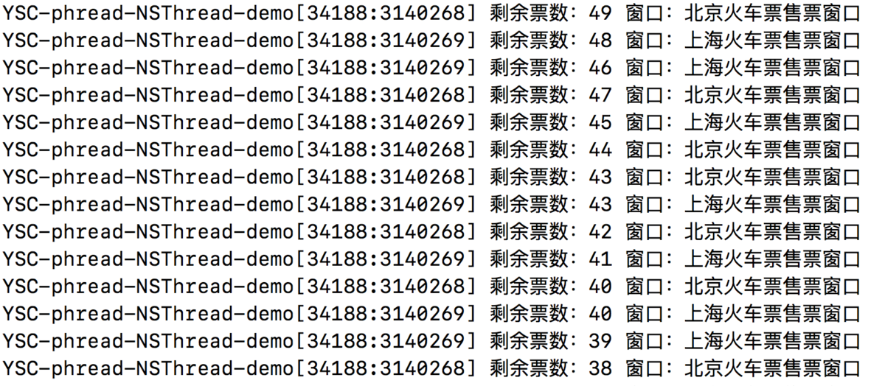

# 线程【pthread、NSThread】 详尽总结

https://www.jianshu.com/p/cbaeea5368b1
本文用来介绍 iOS 多线程中，pthread、NSThread 的使用方法及实现。
第一部分：pthread 的使用、其他相关方法。
第二部分：NSThread 的使用、线程相关用法、线程状态控制方法、线程之间的通信、线程安全和线程同步，以及线程的状态转换相关知识。

1. pthread

1.1 pthread 简介

pthread 是一套通用的多线程的 API，可以在Unix / Linux / Windows 等系统跨平台使用，使用 C 语言编写，需要程序员自己管理线程的生命周期，使用难度较大，我们在 iOS 开发中几乎不使用 pthread，但是还是来可以了解一下的。

引自 百度百科
POSIX 线程（POSIX threads），简称 Pthreads，是线程的 POSIX 标准。该标准定义了创建和操纵线程的一整套 API。在类Unix操作系统（Unix、Linux、Mac OS X等）中，都使用 Pthreads 作为操作系统的线程。Windows 操作系统也有其移植版 pthreads-win32。

引自 维基百科
POSIX 线程（英语：POSIX Threads，常被缩写 为 Pthreads）是 POSIX 的线程标准，定义了创建和操纵线程的一套 API。
实现 POSIX 线程标准的库常被称作 Pthreads，一般用于 Unix-like POSIX 系统，如 Linux、Solaris。但是 Microsoft Windows 上的实现也存在，例如直接使用 Windows API 实现的第三方库 pthreads-w32；而利用 Windows 的 SFU/SUA 子系统，则可以使用微软提供的一部分原生 POSIX API。

1.2 pthread 使用方法
首先要包含头文件#import <pthread.h>
其次要创建线程，并开启线程执行任务

```
// 1. 创建线程: 定义一个pthread_t类型变量
pthread_t thread;
// 2. 开启线程: 执行任务
pthread_create(&thread, NULL, run, NULL);
// 3. 设置子线程的状态设置为 detached，该线程运行结束后会自动释放所有资源
pthread_detach(thread);
void * run(void *param)    // 新线程调用方法，里边为需要执行的任务
{
    NSLog(@"%@", [NSThread currentThread]);

    return NULL;
}

```
pthread_create(&thread, NULL, run, NULL); 中各项参数含义：
第一个参数&thread是线程对象，指向线程标识符的指针
第二个是线程属性，可赋值NULL
第三个run表示指向函数的指针(run对应函数里是需要在新线程中执行的任务)
第四个是运行函数的参数，可赋值NULL


1.3 pthread 其他相关方法

pthread_create() 创建一个线程
pthread_exit() 终止当前线程
pthread_cancel() 中断另外一个线程的运行
pthread_join() 阻塞当前的线程，直到另外一个线程运行结束
pthread_attr_init() 初始化线程的属性
pthread_attr_setdetachstate() 设置脱离状态的属性（决定这个线程在终止时是否可以被结合）
pthread_attr_getdetachstate() 获取脱离状态的属性
pthread_attr_destroy() 删除线程的属性
pthread_kill() 向线程发送一个信号

2. NSThread

NSThread 是苹果官方提供的，使用起来比 pthread 更加面向对象，简单易用，可以直接操作线程对象。不过也需要需要程序员自己管理线程的生命周期(主要是创建)，我们在开发的过程中偶尔使用 NSThread。比如我们会经常调用[NSThread currentThread]来显示当前的进程信息。

下边我们说说 NSThread 如何使用。

2.1 创建、启动线程

先创建线程，再启动线程

2.1 创建、启动线程

```
先创建线程，再启动线程
// 1. 创建线程
NSThread *thread = [[NSThread alloc] initWithTarget:self selector:@selector(run) object:nil];
// 2. 启动线程
[thread start];    // 线程一启动，就会在线程thread中执行self的run方法

// 新线程调用方法，里边为需要执行的任务
- (void)run {
     NSLog(@"%@", [NSThread currentThread]);
}
创建线程后自动启动线程
// 1. 创建线程后自动启动线程
[NSThread detachNewThreadSelector:@selector(run) toTarget:self withObject:nil];

// 新线程调用方法，里边为需要执行的任务
- (void)run {
     NSLog(@"%@", [NSThread currentThread]);
}
```


隐式创建并启动线程
// 1. 隐式创建并启动线程

```
[self performSelectorInBackground:@selector(run) withObject:nil];

// 新线程调用方法，里边为需要执行的任务
- (void)run {
     NSLog(@"%@", [NSThread currentThread]);
}
```

2.2 线程相关用法


```
// 获得主线程
+ (NSThread *)mainThread;    

// 判断是否为主线程(对象方法)
- (BOOL)isMainThread;

// 判断是否为主线程(类方法)
+ (BOOL)isMainThread;    

// 获得当前线程
NSThread *current = [NSThread currentThread];

// 线程的名字——setter方法
- (void)setName:(NSString *)n;    

// 线程的名字——getter方法
- (NSString *)name;    
```

2.3 线程状态控制方法

启动线程方法
_
- (void)start;
// 线程进入就绪状态 -> 运行状态。当线程任务执行完毕，自动进入死亡状态

阻塞（暂停）线程方法

+ (void)sleepUntilDate:(NSDate *)date;
+ (void)sleepForTimeInterval:(NSTimeInterval)ti;
// 线程进入阻塞状态

强制停止线程
+ (void)exit;
// 线程进入死亡状态

2.4 线程之间的通信

在开发中，我们经常会在子线程进行耗时操作，操作结束后再回到主线程去刷新 UI。这就涉及到了子线程和主线程之间的通信。我们先来了解一下官方关于 NSThread 的线程间通信的方法。


```// 在主线程上执行操作
- (void)performSelectorOnMainThread:(SEL)aSelector withObject:(id)arg waitUntilDone:(BOOL)wait;
- (void)performSelectorOnMainThread:(SEL)aSelector withObject:(id)arg waitUntilDone:(BOOL)wait modes:(NSArray<NSString *> *)array;
  // equivalent to the first method with kCFRunLoopCommonModes

// 在指定线程上执行操作
- (void)performSelector:(SEL)aSelector onThread:(NSThread *)thr withObject:(id)arg waitUntilDone:(BOOL)wait modes:(NSArray *)array NS_AVAILABLE(10_5, 2_0);
- (void)performSelector:(SEL)aSelector onThread:(NSThread *)thr withObject:(id)arg waitUntilDone:(BOOL)wait NS_AVAILABLE(10_5, 2_0);

// 在当前线程上执行操作，调用 NSObject 的 performSelector:相关方法
- (id)performSelector:(SEL)aSelector;
- (id)performSelector:(SEL)aSelector withObject:(id)object;
- (id)performSelector:(SEL)aSelector withObject:(id)object1 withObject:(id)object2;
```

下面通过一个经典的下载图片 DEMO 来展示线程之间的通信。具体步骤如下：

开启一个子线程，在子线程中下载图片。
回到主线程刷新 UI，将图片展示在 UIImageView 中。
DEMO 代码如下：


```
/**
 * 创建一个线程下载图片
 */
- (void)downloadImageOnSubThread {
    // 在创建的子线程中调用downloadImage下载图片
    [NSThread detachNewThreadSelector:@selector(downloadImage) toTarget:self withObject:nil];
}

/**
 * 下载图片，下载完之后回到主线程进行 UI 刷新
 */
- (void)downloadImage {
    NSLog(@"current thread -- %@", [NSThread currentThread]);
    
    // 1. 获取图片 imageUrl
    NSURL *imageUrl = [NSURL URLWithString:@"https://ysc-demo-1254961422.file.myqcloud.com/YSC-phread-NSThread-demo-icon.jpg"];
    
    // 2. 从 imageUrl 中读取数据(下载图片) -- 耗时操作
    NSData *imageData = [NSData dataWithContentsOfURL:imageUrl];
    // 通过二进制 data 创建 image
    UIImage *image = [UIImage imageWithData:imageData];
    
    // 3. 回到主线程进行图片赋值和界面刷新
    [self performSelectorOnMainThread:@selector(refreshOnMainThread:) withObject:image waitUntilDone:YES];
}

/**
 * 回到主线程进行图片赋值和界面刷新
 */
- (void)refreshOnMainThread:(UIImage *)image {
    NSLog(@"current thread -- %@", [NSThread currentThread]);
    
    // 赋值图片到imageview
    self.imageView.image = image;
}
```


2.5 NSThread 线程安全和线程同步

线程安全：如果你的代码所在的进程中有多个线程在同时运行，而这些线程可能会同时运行这段代码。如果每次运行结果和单线程运行的结果是一样的，而且其他的变量的值也和预期的是一样的，就是线程安全的。

若每个线程中对全局变量、静态变量只有读操作，而无写操作，一般来说，这个全局变量是线程安全的；若有多个线程同时执行写操作（更改变量），一般都需要考虑线程同步，否则的话就可能影响线程安全。

线程同步：可理解为线程 A 和 线程 B 一块配合，A 执行到一定程度时要依靠线程 B 的某个结果，于是停下来，示意 B 运行；B 依言执行，再将结果给 A；A 再继续操作。

举个简单例子就是：两个人在一起聊天。两个人不能同时说话，避免听不清(操作冲突)。等一个人说完(一个线程结束操作)，另一个再说(另一个线程再开始操作)。

下面，我们模拟火车票售卖的方式，实现 NSThread 线程安全和解决线程同步问题。

场景：总共有50张火车票，有两个售卖火车票的窗口，一个是北京火车票售卖窗口，另一个是上海火车票售卖窗口。两个窗口同时售卖火车票，卖完为止。

2.5.1 NSThread 非线程安全

先来看看不考虑线程安全的代码：

/**
 * 初始化火车票数量、卖票窗口(非线程安全)、并开始卖票
 */
- (void)initTicketStatusNotSave {
    // 1. 设置剩余火车票为 50
    self.ticketSurplusCount = 50;
    
    // 2. 设置北京火车票售卖窗口的线程
    self.ticketSaleWindow1 = [[NSThread alloc]initWithTarget:self selector:@selector(saleTicketNotSafe) object:nil];
    self.ticketSaleWindow1.name = @"北京火车票售票窗口";
    
    // 3. 设置上海火车票售卖窗口的线程
    self.ticketSaleWindow2 = [[NSThread alloc]initWithTarget:self selector:@selector(saleTicketNotSafe) object:nil];
    self.ticketSaleWindow2.name = @"上海火车票售票窗口";
    
    // 4. 开始售卖火车票
    [self.ticketSaleWindow1 start];
    [self.ticketSaleWindow2 start];

}

/**
 * 售卖火车票(非线程安全)
 */
- (void)saleTicketNotSafe {
    while (1) {
        //如果还有票，继续售卖
        if (self.ticketSurplusCount > 0) {
            self.ticketSurplusCount --;
            NSLog(@"%@", [NSString stringWithFormat:@"剩余票数：%ld 窗口：%@", self.ticketSurplusCount, [NSThread currentThread].name]);
            [NSThread sleepForTimeInterval:0.2];
        }
        //如果已卖完，关闭售票窗口
        else {
            NSLog(@"所有火车票均已售完");
            break;
        }
    }
}
运行后部分结果为：


可以看出，在考虑了线程安全的情况下，使用 dispatch_semaphore
机制之后，得到的票数是正确的，没有出现混乱的情况。我们也就解决了多个线程同步的问题。