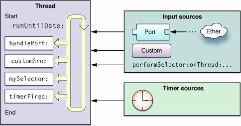
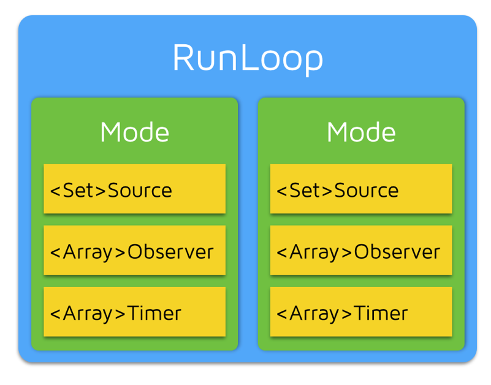
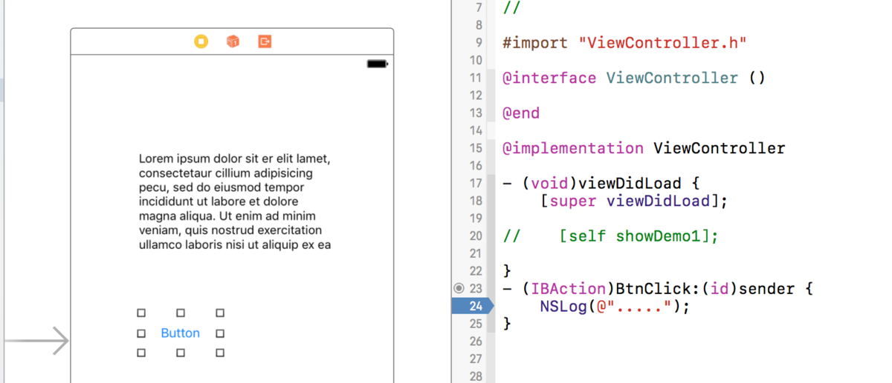
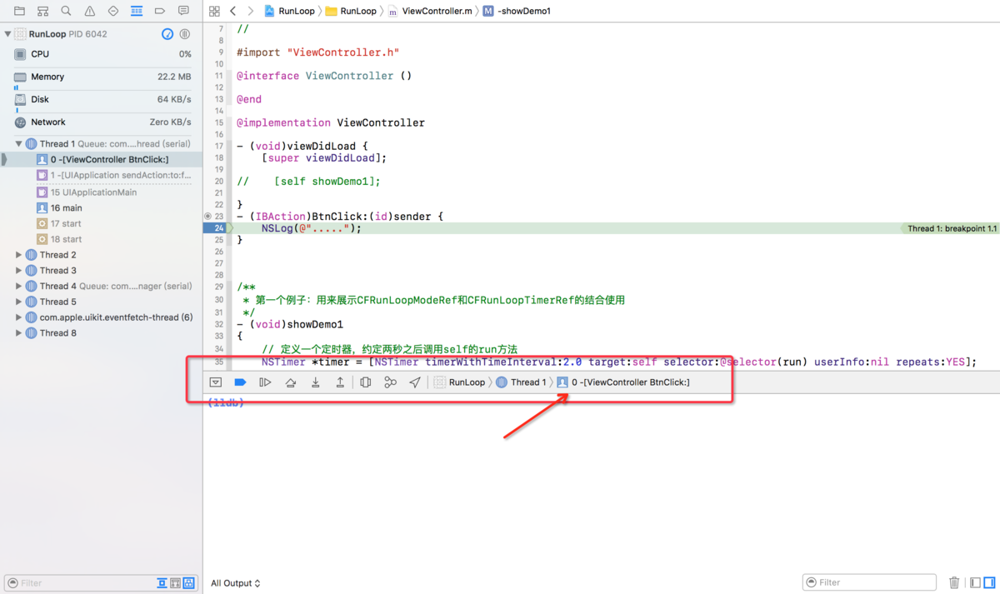
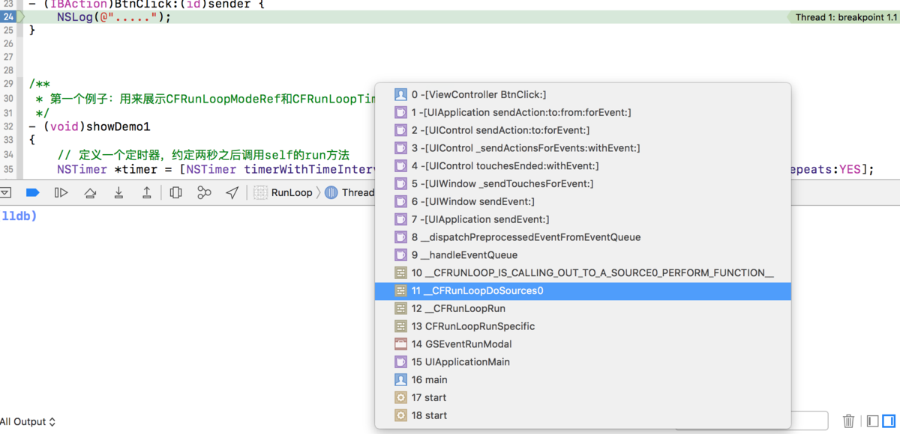
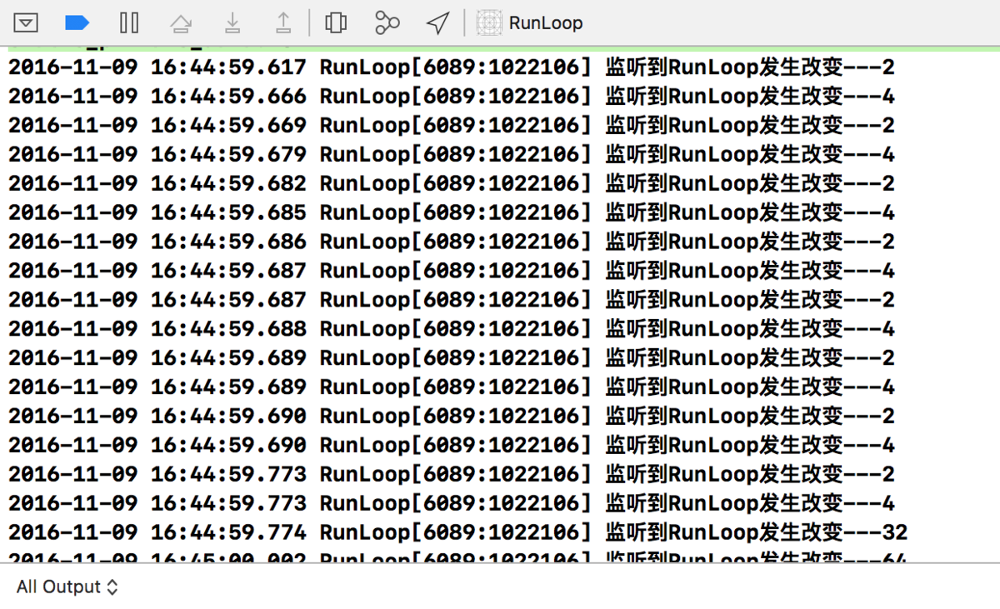
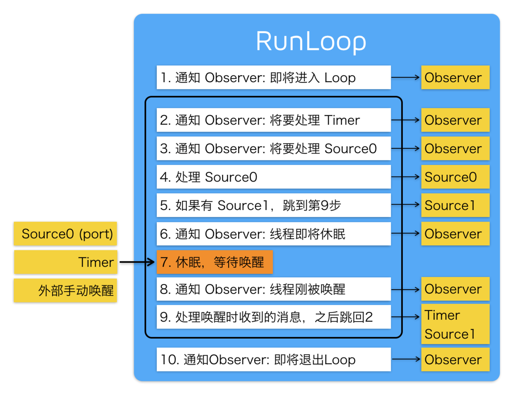
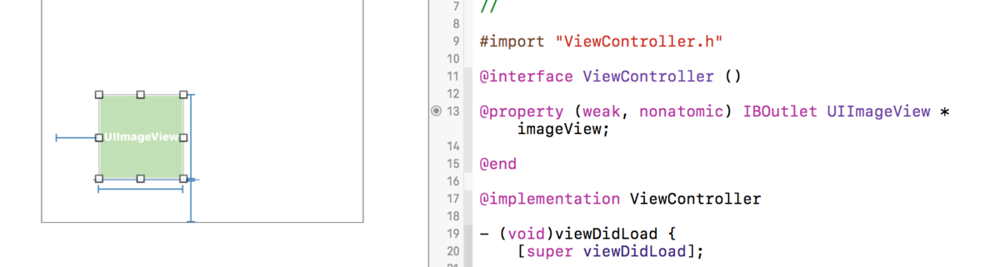
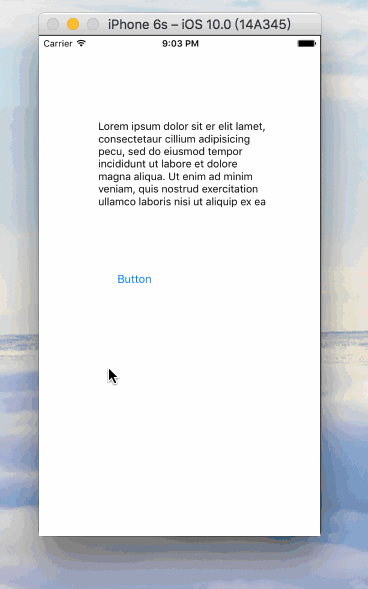
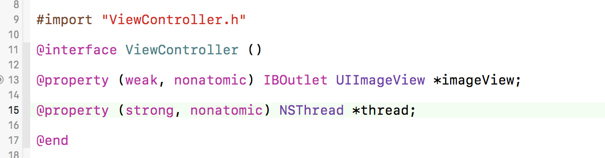

# iOS 多线程：『RunLoop』详尽总结
https://www.jianshu.com/p/d260d18dd551

RunLoop总结：RunLoop的应用场景（三）滚动视图流畅性优化(
https://juejin.im/post/5d1ab3cdf265da1bb67a31a9
)
(绘制像素到屏幕上)
https://objccn.io/issue-3-1/

1. RunLoop 简介
1.1 什么是 RunLoop？

1.1 什么是 RunLoop？

可以理解为字面意思：Run 表示运行，Loop 表示循环。结合在一起就是运行的循环的意思。哈哈，我更愿意翻译为『跑圈』。直观理解就像是不停的跑圈。

RunLoop 实际上是一个对象，这个对象在循环中用来处理程序运行过程中出现的各种事件（比如说触摸事件、UI刷新事件、定时器事件、Selector事件），从而保持程序的持续运行。
RunLoop 在没有事件处理的时候，会使线程进入睡眠模式，从而节省 CPU 资源，提高程序性能。

1.一条线程对应一个RunLoop对象，每条线程都有唯一一个与之对应的 RunLoop 对象。
2.RunLoop 并不保证线程安全。我们只能在当前线程内部操作当前线程的 RunLoop 对象，而不能在当前线程内部去操作其他线程的 RunLoop 对象方法。
3.RunLoop 对象在第一次获取 RunLoop 时创建，销毁则是在线程结束的时候。
4.主线程的 RunLoop 对象系统自动帮助我们创建好了（原理如 1.3 所示），而子线程的 RunLoop对象需要我们主动创建和维护。

1.3 默认情况下主线程的 RunLoop 原理

我们在启动一个iOS程序的时候，系统会调用创建项目时自动生成的 main.m 的文件。main.m文件如下所示：


```
int main(int argc, char * argv[]) {
    @autoreleasepool {
        return UIApplicationMain(argc, argv, nil, NSStringFromClass([AppDelegate class]));
    }
}

```

其中 UIApplicationMain 函数内部帮我们开启了主线程的 RunLoop，UIApplicationMain 内部拥有一个无限循环的代码，只要程序不退出/崩溃，它就一直循环。上边的代码中主线程开启 RunLoop 的过程可以简单的理解为如下代码：

int main(int argc, char * argv[]) {        
    BOOL running = YES;
    do {
        // 执行各种任务，处理各种事件
        // ......
    } while (running);  // 判断是否需要退出

    return 0;
}


从上边可看出，程序一直在 do-while 循环中执行，所以 UIApplicationMain 函数一直没有返回，我们在运行程序之后程序不会马上退出，会保持持续运行状态。
下图是苹果官方给出的 RunLoop 模型图。




2. RunLoop 相关类

下面我们来了解一下Core Foundation框架下关于 RunLoop 的 5 个类，只有弄懂这几个类的含义，我们才能深入了解 RunLoop 的运行机制。

CFRunLoopRef：代表 RunLoop 的对象
CFRunLoopModeRef：代表 RunLoop 的运行模式
CFRunLoopSourceRef：就是 RunLoop 模型图中提到的输入源 / 事件源
CFRunLoopTimerRef：就是 RunLoop 模型图中提到的定时源
CFRunLoopObserverRef：观察者，能够监听 RunLoop 的状态改变
下边详细讲解下几种类的具体含义和关系。

先来看一张表示这 5 个类的关系图帮助理解（来源：http://blog.ibireme.com/2015/05/18/runloop/）。




接着来讲解这 5 个类的相互关系：

一个RunLoop对象（CFRunLoopRef）中包含若干个运行模式（CFRunLoopModeRef）。而每一个运行模式下又包含若干个输入源（CFRunLoopSourceRef）、定时源（CFRunLoopTimerRef）、观察者（CFRunLoopObserverRef）。

每次 RunLoop 启动时，只能指定其中一个运行模式（CFRunLoopModeRef），这个运行模式（CFRunLoopModeRef）被称作当前运行模式（CurrentMode）。
如果需要切换运行模式（CFRunLoopModeRef），只能退出当前 Loop，再重新指定一个运行模式（CFRunLoopModeRef）进入。
这样做主要是为了分隔开不同组的输入源（CFRunLoopSourceRef）、定时源（CFRunLoopTimerRef）、观察者（CFRunLoopObserverRef），让其互不影响 。
下边我们来详细讲解下这五个类：

2.1 CFRunLoopRef 类

CFRunLoopRef 是 Core Foundation 框架下 RunLoop 对象类。我们可通过以下方式来获取 RunLoop 对象：

Core Foundation
CFRunLoopGetCurrent(); // 获得当前线程的 RunLoop 对象
CFRunLoopGetMain(); // 获得主线程的 RunLoop 对象
当然，在Foundation 框架下获取 RunLoop 对象类的方法如下：

Foundation
[NSRunLoop currentRunLoop]; // 获得当前线程的 RunLoop 对象
[NSRunLoop mainRunLoop]; // 获得主线程的 RunLoop 对象


**2.2 CFRunLoopModeRef**

系统默认定义了多种运行模式（CFRunLoopModeRef），如下：

1.kCFRunLoopDefaultMode：App的默认运行模式，通常主线程是在这个运行模式下运行

2.UITrackingRunLoopMode：跟踪用户交互事件（用于 ScrollView 追踪触摸滑动，保证界面滑动时不受其他Mode影响）

3.UIInitializationRunLoopMode：在刚启动App时第进入的第一个 Mode，启动完成后就不再使用

4.GSEventReceiveRunLoopMode：接受系统内部事件，通常用不到

5.kCFRunLoopCommonModes：伪模式，不是一种真正的运行模式（后边会用到）

其中kCFRunLoopDefaultMode、UITrackingRunLoopMode、kCFRunLoopCommonModes是我们开发中需要用到的模式，具体使用方法我们在 2.3 CFRunLoopTimerRef 中结合CFRunLoopTimerRef来演示说明。

2.3 CFRunLoopTimerRef

CFRunLoopTimerRef是定时源（RunLoop模型图中提到过），理解为基于时间的触发器，基本上就是NSTimer（哈哈，这个理解就简单了吧）。

下面我们来演示下CFRunLoopModeRef和CFRunLoopTimerRef结合的使用用法，从而加深理解。

首先我们新建一个iOS项目，在Main.storyboard中拖入一个Text View。
在ViewController.m文件中加入以下代码，Demo中请调用[self ShowDemo1];来演示。


```- (void)viewDidLoad {
    [super viewDidLoad];

    // 定义一个定时器，约定两秒之后调用self的run方法
    NSTimer *timer = [NSTimer timerWithTimeInterval:2.0 target:self selector:@selector(run) userInfo:nil repeats:YES];

    // 将定时器添加到当前RunLoop的NSDefaultRunLoopMode下
    [[NSRunLoop currentRunLoop] addTimer:timer forMode:NSDefaultRunLoopMode];
}

- (void)run
{
    NSLog(@"---run");
}

```
然后运行，这时候我们发现如果我们不对模拟器进行任何操作的话，定时器会稳定的每隔2秒调用run方法打印。

但是当我们拖动Text View滚动时，我们发现：run方法不打印了，也就是说NSTimer不工作了。而当我们松开鼠标的时候，NSTimer就又开始正常工作了。

这是因为：

当我们不做任何操作的时候，RunLoop处于NSDefaultRunLoopMode下。
而当我们拖动Text View的时候，RunLoop就结束NSDefaultRunLoopMode，切换到了UITrackingRunLoopMode模式下，这个模式下没有添加NSTimer，所以我们的NSTimer就不工作了。
但当我们松开鼠标的时候，RunLoop就结束UITrackingRunLoopMode模式，又切换回NSDefaultRunLoopMode模式，所以NSTimer就又开始正常工作了。
你可以试着将上述代码中的[[NSRunLoop currentRunLoop] addTimer:timer forMode:NSDefaultRunLoopMode];语句换为[[NSRunLoop currentRunLoop] addTimer:timer forMode:UITrackingRunLoopMode];，也就是将定时器添加到当前RunLoop的UITrackingRunLoopMode下，你就会发现定时器只会在拖动Text View的模式下工作，而不做操作的时候定时器就不工作。

那难道我们就不能在这两种模式下让NSTimer都能正常工作吗？

当然可以，这就用到了我们之前说过的伪模式（kCFRunLoopCommonModes），这其实不是一种真实的模式，而是一种标记模式，意思就是可以在打上Common Modes标记的模式下运行。

那么哪些模式被标记上了Common Modes呢？

NSDefaultRunLoopMode 和 UITrackingRunLoopMode。

所以我们只要我们将NSTimer添加到当前RunLoop的kCFRunLoopCommonModes（Foundation框架下为NSRunLoopCommonModes）下，我们就可以让NSTimer在不做操作和拖动Text View两种情况下愉快的正常工作了。

具体做法就是讲添加语句改为[[NSRunLoop currentRunLoop] addTimer:timer forMode:NSRunLoopCommonModes];

既然讲到了NSTimer，这里顺便讲下NSTimer中的scheduledTimerWithTimeInterval方法和RunLoop的关系。添加下面的代码：


```
[NSTimer scheduledTimerWithTimeInterval:2.0 target:self selector:@selector(run) userInfo:nil repeats:YES];
```

这句代码调用了scheduledTimer返回的定时器，NSTimer会自动被加入到了RunLoop的NSDefaultRunLoopMode模式下。这句代码相当于下面两句代码：


```
NSTimer *timer = [NSTimer timerWithTimeInterval:2.0 target:self selector:@selector(run) userInfo:nil repeats:YES];
[[NSRunLoop currentRunLoop] addTimer:timer forMode:NSDefaultRunLoopMode];
```

2.4 CFRunLoopSourceRef

CFRunLoopSourceRef是事件源（RunLoop模型图中提到过），CFRunLoopSourceRef有两种分类方法。

第一种按照官方文档来分类（就像RunLoop模型图中那样）：
Port-Based Sources（基于端口）
Custom Input Sources（自定义）
Cocoa Perform Selector Sources
第二种按照函数调用栈来分类：
Source0 ：非基于Port
Source1：基于Port，通过内核和其他线程通信，接收、分发系统事件
这两种分类方式其实没有区别，只不过第一种是通过官方理论来分类，第二种是在实际应用中通过调用函数来分类。

下边我们举个例子大致来了解一下函数调用栈和Source。

在我们的项目中的Main.storyboard中添加一个Button按钮，并添加点击动作。
然后在点击动作的代码中加入一句输出语句，并打上断点，如下图所示：



3.然后运行程序，并点击按钮。
4.然后在项目中单击下下图红色部分。



5.可以看到如下图所示就是点击事件产生的函数调用栈。




所以点击事件是这样来的：

1.首先程序启动，调用16行的main函数，main函数调用15行UIApplicationMain函数，然后一直往上调用函数，最终调用到0行的BtnClick函数，即点击函数。

2.同时我们可以看到11行中有Sources0，也就是说我们点击事件是属于Sources0函数的，点击事件就是在Sources0中处理的。

3.而至于Sources1，则是用来接收、分发系统事件，然后再分发到Sources0中处理的。

2.5 CFRunLoopObserverRef


```
CFRunLoopObserverRef是观察者，用来监听RunLoop的状态改变

CFRunLoopObserverRef可以监听的状态改变有以下几种：

typedef CF_OPTIONS(CFOptionFlags, CFRunLoopActivity) {
    kCFRunLoopEntry = (1UL << 0),               // 即将进入Loop：1
    kCFRunLoopBeforeTimers = (1UL << 1),        // 即将处理Timer：2    
    kCFRunLoopBeforeSources = (1UL << 2),       // 即将处理Source：4
    kCFRunLoopBeforeWaiting = (1UL << 5),       // 即将进入休眠：32
    kCFRunLoopAfterWaiting = (1UL << 6),        // 即将从休眠中唤醒：64
    kCFRunLoopExit = (1UL << 7),                // 即将从Loop中退出：128
    kCFRunLoopAllActivities = 0x0FFFFFFFU       // 监听全部状态改变  
};
```

下边我们通过代码来监听下RunLoop中的状态改变。

在ViewController.m中添加如下代码，Demo中请调用[self showDemo2];方法。

```
- (void)viewDidLoad {
    [super viewDidLoad];

    // 创建观察者
    CFRunLoopObserverRef observer = CFRunLoopObserverCreateWithHandler(CFAllocatorGetDefault(), kCFRunLoopAllActivities, YES, 0, ^(CFRunLoopObserverRef observer, CFRunLoopActivity activity) {
        NSLog(@"监听到RunLoop发生改变---%zd",activity);
    });

    // 添加观察者到当前RunLoop中
    CFRunLoopAddObserver(CFRunLoopGetCurrent(), observer, kCFRunLoopDefaultMode);

    // 释放observer，最后添加完需要释放掉
    CFRelease(observer);
}
```
2.然后运行，看下打印结果，如下图。


可以看到RunLoop的状态在不断的改变，最终变成了状态 32，也就是即将进入睡眠状态，说明RunLoop之后就会进入睡眠状态。

3. RunLoop原理

好了，五个类都讲解完了，下边开始放大招了。这下我们就可以来理解RunLoop的运行逻辑了。

下边上一张之前提到的文章中博主提供的运行逻辑图（来源：http://blog.ibireme.com/2015/05/18/runloop/）


这张图对于我们理解RunLoop来说太有帮助了，下边我们可以来说下官方文档给我们的RunLoop逻辑。

在每次运行开启RunLoop的时候，所在线程的RunLoop会自动处理之前未处理的事件，并且通知相关的观察者。

具体的顺序如下：

* 通知观察者RunLoop已经启动
* 通知观察者即将要开始的定时器
* 通知观察者任何即将启动的非基于端口的源
* 启动任何准备好的非基于端口的源
* 如果基于端口的源准备好并处于等待状态，立即启动；并进入步骤9
* 通知观察者线程进入休眠状态
* 将线程置于休眠知道任一下面的事件发生：
     某一事件到达基于端口的源
     定时器启动
     RunLoop设置的时间已经超时
     RunLoop被显示唤醒
* 通知观察者线程将被唤醒
* 处理未处理的事件
    如果用户定义的定时器启动，处理定时器事件并重启RunLoop。进入步骤2
    如果输入源启动，传递相应的消息
    如果RunLoop被显示唤醒而且时间还没超时，重启RunLoop。进入步骤2
* 通知观察者RunLoop结束。


4. RunLoop实战应用

哈哈，讲了这么多云里雾里的原理知识，下边终于到了实战应用环节。

光弄懂是没啥用的，能够实战应用才是硬道理。下面讲解一下RunLoop的几种应用。

4.1 NSTimer的使用

NSTimer的使用方法在讲解CFRunLoopTimerRef类的时候详细讲解过，具体参考上边 2.3 CFRunLoopTimerRef。


4.2 ImageView推迟显示

有时候，我们会遇到这种情况：
当界面中含有UITableView，而且每个UITableViewCell里边都有图片。这时候当我们滚动UITableView的时候，如果有一堆的图片需要显示，那么可能会出现卡顿的现象。

怎么解决这个问题呢？

这时候，我们应该推迟图片的显示，也就是ImageView推迟显示图片。有两种方法：

1. 监听UIScrollView的滚动

因为UITableView继承自UIScrollView，所以我们可以通过监听UIScrollView的滚动，实现UIScrollView相关delegate即可。

2. 利用PerformSelector设置当前线程的RunLoop的运行模式

利用performSelector方法为UIImageView调用setImage:方法，并利用inModes将其设置为RunLoop下NSDefaultRunLoopMode运行模式。代码如下：


```
[self.imageView performSelector:@selector(setImage:) withObject:[UIImage imageNamed:@"tupian"] afterDelay:4.0 inModes:NSDefaultRunLoopMode];
```
下边利用Demo演示一下该方法。

1.在项目中的Main.storyboard中添加一个UIImageView，并添加属性，并简单添加一下约束（不然无法显示）如下图所示。




2.在项目中拖入一张图片，比如下图。


3.然后我们在touchesBegan方法中添加下面的代码，在Demo中请在touchesBegan中调用[self showDemo3];方法。


```
- (void)touchesBegan:(NSSet<UITouch *> *)touches withEvent:(UIEvent *)event
{
    [self.imageView performSelector:@selector(setImage:) withObject:[UIImage imageNamed:@"tupian"] afterDelay:4.0 inModes:@[NSDefaultRunLoopMode]];
}

```


4.运行程序，点击一下屏幕，然后拖动UIText View，拖动4秒以上，发现过了4秒之后，UIImageView还没有显示图片，当我们松开的时候，则显示图片，效果如下：



这样我们就实现了在拖动完之后，在延迟显示UIImageView。

4.3 后台常驻线程（很常用）

我们在开发应用程序的过程中，如果后台操作特别频繁，经常会在子线程做一些耗时操作（下载文件、后台播放音乐等），我们最好能让这条线程永远常驻内存。

那么怎么做呢？

添加一条用于常驻内存的强引用的子线程，在该线程的RunLoop下添加一个Sources，开启RunLoop。

具体实现过程如下：

1.在项目的ViewController.m中添加一条强引用的thread线程属性，如下图：




2.在viewDidLoad中创建线程self.thread，使线程启动并执行run1方法，代码如下。在Demo中，请在viewDidLoad调用[self showDemo4];方法。


```
- (void)viewDidLoad {
    [super viewDidLoad];

    // 创建线程，并调用run1方法执行任务
    self.thread = [[NSThread alloc] initWithTarget:self selector:@selector(run1) object:nil];
    // 开启线程
    [self.thread start];    
}

- (void) run1
{
    // 这里写任务
    NSLog(@"----run1-----");

    // 添加下边两句代码，就可以开启RunLoop，之后self.thread就变成了常驻线程，可随时添加任务，并交于RunLoop处理
    [[NSRunLoop currentRunLoop] addPort:[NSPort port] forMode:NSDefaultRunLoopMode];
    [[NSRunLoop currentRunLoop] run];

    // 测试是否开启了RunLoop，如果开启RunLoop，则来不了这里，因为RunLoop开启了循环。
    NSLog(@"未开启RunLoop");


```


3.运行之后发现打印了----run1-----，而未开启RunLoop则未打印。
这时，我们就开启了一条常驻线程，下边我们来试着添加其他任务，除了之前创建的时候调用了run1方法，我们另外在点击的时候调用run2方法。

那么，我们在touchesBegan中调用PerformSelector，从而实现在点击屏幕的时候调用run2方法。Demo地址。具体代码如下：


```
- (void)touchesBegan:(NSSet<UITouch *> *)touches withEvent:(UIEvent *)event
{   
    // 利用performSelector，在self.thread的线程中调用run2方法执行任务
    [self performSelector:@selector(run2) onThread:self.thread withObject:nil waitUntilDone:NO];
}

- (void) run2
{
    NSLog(@"----run2------");
}
```


经过运行测试，除了之前打印的----run1-----，每当我们点击屏幕，都能调用----run2------。
这样我们就实现了常驻线程的需求。