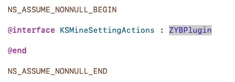

#2020年日志-

9月2号

相机组件化：排期
 9.15  pod库开发完成   
 9.30号 口算集成pod完成  
 10.15号 接入文档整理完成 （目标是 10.01节后的上线版本用这个pod）
8月20
8月17
智能练习报告 完成

8月17 周一
1.上午需求开发
「 
智能练习报告
手动批改错图标
」
下午：
整理相机相关的每一个API 
晚上：
1.基础学习和进阶
2.在职研究生「知识搜索」

8月14：
1.swift相机代码整理出来
2.工作排期（4.10.0）{
*     批改记录 25
*     智能练习报告 28
*     手动批改错图标25
*     语文诗词题型批改28
*     

*     

*     }
3.零碎时间回归OC基础知识
4.开始学习考研的知识-
1. 规划一下相机模块的组件化  定个周期出来 目标是 独立 好用  安全

